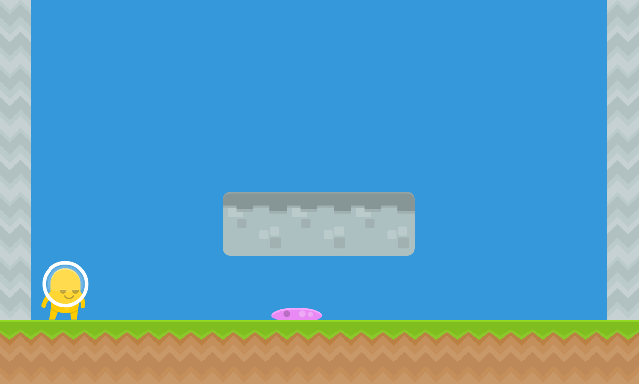

# Kaboom Platformer Demo

Created for a lunch & learn talk.

## Get Started

Clone the repo and install dependencies.

`yarn` or `npm i`

Build and run the game locally in dev mode

`yarn dev` or `npm run dev`

When you are ready to build for deployment

`yarn build` or `npm run build`
